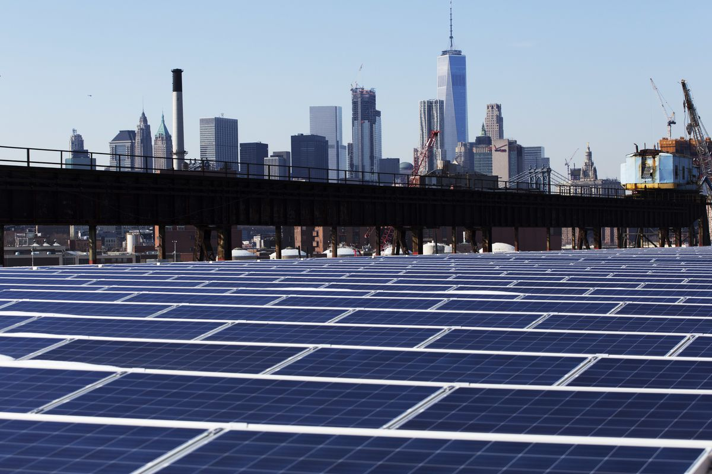
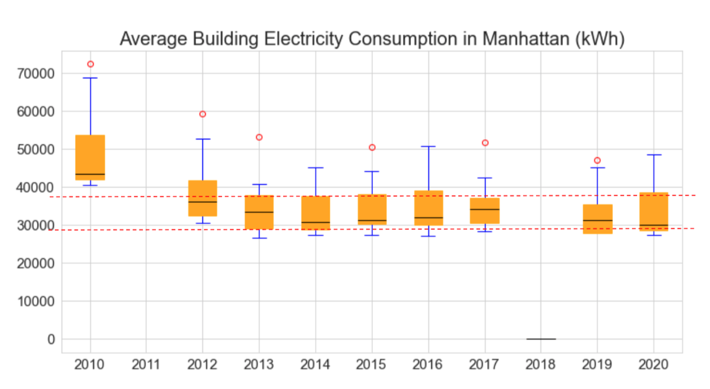
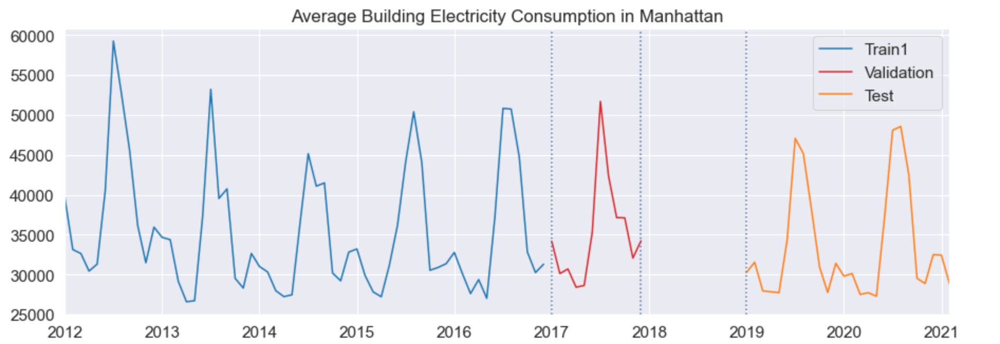
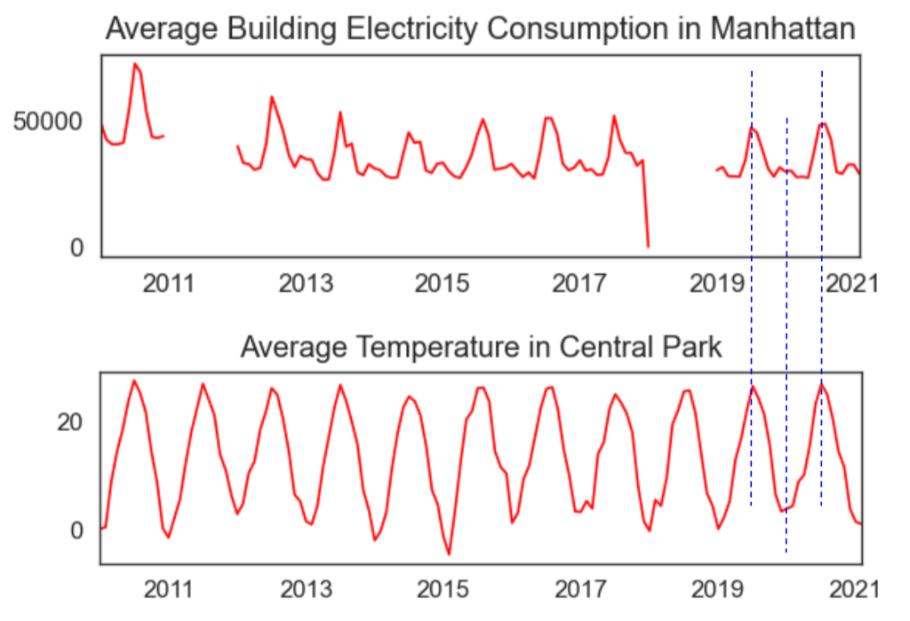
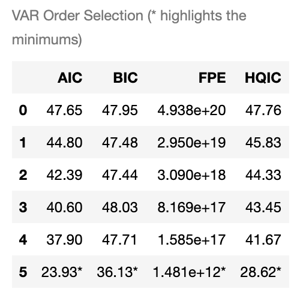
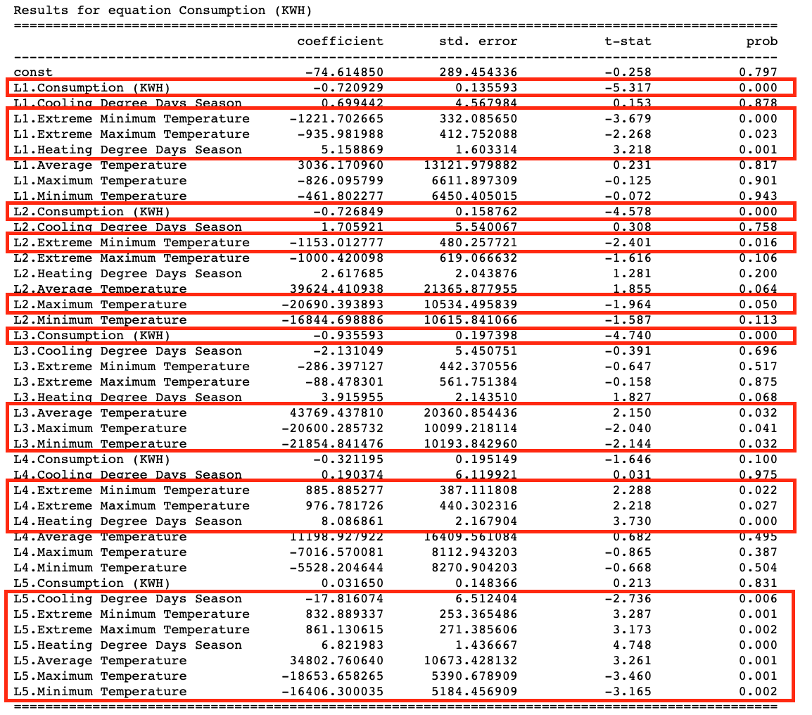
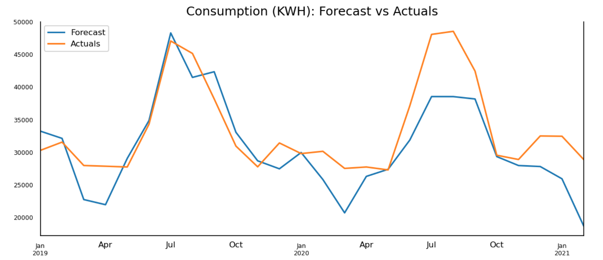

# New York City Energy Demand


Photo courtesy of Mark Lennihan/AP

**Author: Sejin Jang**


## Overview 

According to the UN climate report this year, some of the global warming effects are now irreversible. The effects of this are detrimental, as the sea levels continue to rise, due to the melting of ice in the arctic, areas located below the sea level are at high risk. Furthermore, as the temperature increases, this also results in extreme weather events such as hurricanes, wildfires, and drought. To mitigate global warming, some have already resorted to using clean and renewable energy sources. This can be seen as more communities are trying to replace their traditional energy sources that rely on fossil fuels, with clean energy such as solar and wind. Hence, it is crucial to estimate the future energy demand so that a more clear and realistic goal can be set for the communities.

In this project, I will build a predictive model that estimates the future electricity consumption in New York City with its weather data. Energy usage is correlated with the temperatures. People are more likely to use more air conditioning in hot weather and more heaters during cold periods. The project aims to help decision makers from all sectors understand the magnitude of the global warming effect and to aid in better preparation as we attempt to meet the future energy demand while adopting more clean and renewable energy.


## Data

NYC Electricity Consumption Dataset: The dataset was found at the NYC Open Data website. The data was provided by New York City Housing Authority (NYCHA). It contains monthly electricity consumption and cost data from January 2010 to February 2021 by borough and development. It includes features such as electricity consumption, utility vendor and meter information. The electricity consumption data was provided in kilowatt (kW) as well as in kilowatt-hours (kWh). The difference between kWh and kW is that kW reflects the rate of electricity you use, and kWh indicates the amount of electricity you use. For this project, kWh will be taken into account. https://data.cityofnewyork.us/Housing-Development/Electric-Consumption-And-Cost-2010-April-2020-/jr24-e7cr

NYC Weather Dataset: The dataset was gathered from the National Oceanic and Atmospheric Administration (NOAA), an American scientific and regulatory agency within the United States Department of Commerce. It contains monthly mean maximum, mean minimum and mean temperatures; monthly total precipitation and snowfall; departure from normal of the mean temperature and total precipitation; monthly heating and cooling degree days; number of days that temperatures and precipitation are above or below certain thresholds; extreme daily temperature and precipitation amounts; number of days with fog; and number of days with thunderstorms. https://www.ncdc.noaa.gov/cdo-web/datasets/GSOM/locations/CITY:US360019/detail


## Methods

NYC Electricity Consumption dataset contains 362,630 records. Each record represents a building and a month. It has data from 195 buildings in Manhattan, 69 buildings in the Bronx, 262 buildings in Brooklyn, 93 buildings in Queens and 10 buildings in Staten Island. This is obviously not all the data in New York City as the number of buildings in the dataset is small. When resampling time series datasets, summing the consumption data for each month would be misleading due to the insufficient data. It makes more sense to use mean value for each month. Therefore, I grouped data by borough and resampled by monthly mean value. This means that the resampled figure represents average building electricity consumption in each borough.


Staten Island's average building electricity consumption appears much higher than the rest of New York City. As the dataset includes only 10 buildings in Staten Island, this issue requires further investigation. The dataset also includes rather small number of buildings in Queens and the Bronx. Thus, I decided to focus on Manhattan as a sample for this project. 



The graph above is showing a building’s electricity consumption in Manhattan on average. Except for 2010, which seems rather higher than the other years, and 2011 and 2018 with incomplete and missing data, the Median electricity usage in a year ranges from around 30,000 to 37,000 kWh.

In order to obtain the missing data, I have reached out to New York City Housing Authority who provides the data. Until I hear from them, I have made 4 datasets: 2 versions of train set, 1 validation set and 1 test set. The first version of the train set is the seamless data from 2012 to 2017 (6 years). Within this seamless data, I used the first 5 years as the second version of the train set and the next 1 year as a validation set. I also kept data from 2019 as a test set. The reason I seperate the dataset in this way is to compare the results and see if seamlessness and more training data have any effect on the model performance.



To match the location, I took Central Park’s different types of temperature data. Extreme minimum and maximum temperatures represent the highest daily maximum temperature and the lowest daily minimum temperature for the month. Maximum and minimum temperatures represent average of daily maximum and minimum temperatures. Average temperature is the mean of the maximum and minimum temperatures. 

After merging the two datasets, I can see that weather as well as the electricity consumption have seasonality. The highest consumption is observed in the Summer. The next highest consumption is observed in the Winter. And this is the assumption I use for this project. 



Now, to predict the electricity consumption in any given month, I used models such as Vector AutoRegression (VAR), Vector Autoregression Moving-Average with Exogenous Regressors (VARMAX) as well as Long Short Term Memory (LSTM) Neural Network. The basis behind these models is that this month's electricity consumption can be affected not only by the last month's consumption but also by the last month's temperature. This means that you can predict the future electricity consumption with past values of itself along with past values of temperature. 

The key for VAR and VARMAX modeling is that you have to find the optimal order (lag) value. To find this, you can use an attribute like ".select_order()".



After fitting the model with the optimal order, 5 in this case, I get the equations for all time series variables. Here, I only care about the consumption time series so I focus on the equation for the consumption as seen in the image below. The way I interpret this is that first, I observe which variable is most influential in prediction by looking at the p-values. I consider those under 0.05 are the influential variables, so in this case, those in red boxes are contributing to the consumption prediction the most. My equation is made up of coefficients of all the time series. 



I have also attempted to use LSTM with various parameters. The key to LSTM modeling is that you have to scale the data before fitting. 


## Results

The models are evaluated with RMSE(Root Mean Squared Error), which shows how much kWh are off, and MAPE (Mean Average Percentage Error), which expresses the forecast error by how many percentage points the forecasts are off on average.

The best result is observed when using the second version of train set and the VAR model that includes up to 5 lags for each time series variable. This model's prediction is off by 4,809 kWh, which indicates that about 11% of forecasted data points are off on average. Moreover, it looks like both the seamlessnes and the size of training dataset affect the model performance. 




## Conclusions

In conclusion, the weather data is useful for predicting energy demand. Also, more data will certainly improve the model performance. 

For the future analysis, I would like to continue improving the model using LSTM. I would also like to predict consumption in different boroughs and cities as well as in different scales such as a household level or a state or a country level. It would be interesting to see how adding other time series such as population as well as GDP would affect the prediction. 

I hope that this project inspires more researchers to try to estimate the future energy demand using weather data and help decision makers to better prepare for it while adopting more clean and renewable energy.


### Repository Structure

```
├── Images
├── 1. EDA.ipynb
├── 2. VAR.ipynb
├── 3. LSTM.ipynb
├── EnergyDemand.pdf
└── README.md
```

