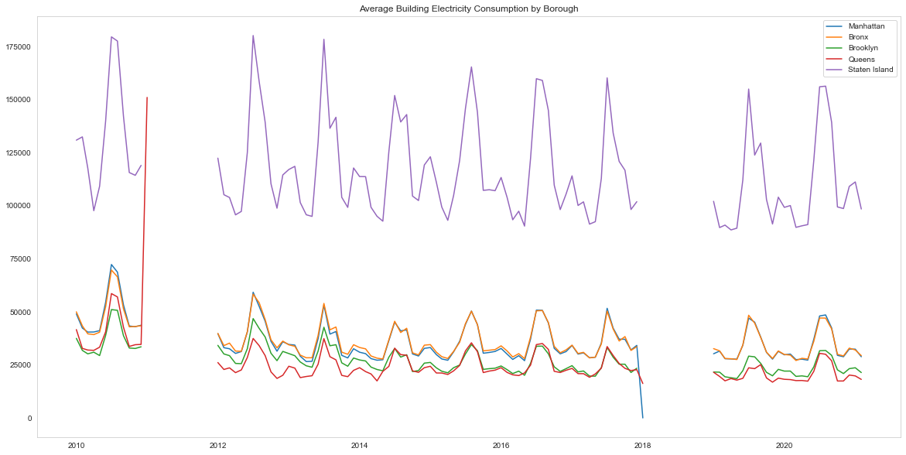

# New York City Energy Demand

**Author**: Sejin Jang


## Overview 

According to the UN climate report this year, some of the global warming effects are now irreversible. The effects of this are detrimental, as the sea levels continue to rise, due to the melting of ice in the arctic, areas located below the sea level are at high risk. Furthermore, as the temperature increases, this also results in extreme weather events such as hurricanes, wildfires, and drought. To mitigate global warming, some have already resorted to using clean and renewable energy sources. This can be seen as more communities are trying to replace their traditional energy sources that rely on fossil fuels, with clean energy such as solar and wind. Hence, it is crucial to estimate the future energy demand so that a more clear and realistic goal can be set for the communities.

In this project, I will build a predictive model that estimates the future electricity consumption in New York City based on its weather data. Energy usage is correlated with the temperatures. People are more likely to use more air conditioning in hot weather and more heaters during cold periods. The project aims to help decision makers from all sectors understand the magnitude of the global warming effect and to aid in better preparation as we attempt to meet the future energy demand while adopting more clean and renewable energy.


## Data

NYC Electricity Consumption Dataset: The dataset was found at the NYC Open Data website. The data was provided by New York City Housing Authority (NYCHA). It contains monthly electricity consumption and cost data from 2010 January to 2021 February by borough and development. It includes features such as electricity consumption, utility vendor and meter information. The electricity consumption data was provided in kilowatt (kW) as well as in kilowatt-hours (kWh). The difference between kWh and kW is that kW reflects the rate of electricity you use, and kWh indicates the amount of electricity you use. For this project, kWh will be taken into account. https://data.cityofnewyork.us/Housing-Development/Electric-Consumption-And-Cost-2010-April-2020-/jr24-e7cr

NYC Weather Dataset: The dataset was gathered from the National Oceanic and Atmospheric Administration (NOAA), an American scientific and regulatory agency within the United States Department of Commerce. It contains monthly mean maximum, mean minimum and mean temperatures; monthly total precipitation and snowfall; departure from normal of the mean temperature and total precipitation; monthly heating and cooling degree days; number of days that temperatures and precipitation are above or below certain thresholds; extreme daily temperature and precipitation amounts; number of days with fog; and number of days with thunderstorms. https://www.ncdc.noaa.gov/cdo-web/datasets/GSOM/locations/CITY:US360019/detail


## Methods

NYC Electricity Consumption dataset contains 362,630 records. Each record represents a building and a month. It has data from 195 buildings in Manhattan, 69 buildings in the Bronx, 262 buildings in Brooklyn, 93 buildings in Queens and 10 buildings in Staten Island. This is obviously not all the data in New York City as the number of buildings in the dataset is small. When resampling time series datasets, summing the consumption data for each month would be misleading due to the insufficient data. It makes more sense to use mean value for each month. Therefore, I grouped data by borough and resampled by monthly mean value. This means that the resampled figure represents average building electricity consumption in each borough.



Staten Island's average building electricity consumption appears much higher than the rest of New York City. As the dataset includes only 10 buildings in Staten Islands, this issue requires further investigation. The dataset also includes rather small number of buildings in Queens and the Bronx. Thus, I decided to focus on Manhattan as a sample for this project. 


The graph above is showing a building’s electricity consumption in Manhattan on average. Except for 2010, which seems rather higher than the other years, and 2011 and 2018 with incomplete and missing data, the Median electricity usage in a year ranges from around 30,000 to 37,000 kilowatt-hours.

In order to obatin the missing data, I have reached out to New York City Housing Authority who provides the data. Until I hear from them, I have made 4 datasets: 2 versions of train set, 1 validation set and 1 test set. The first version of the train set is the seamless data from 2012 to 2017 (6 years). Within this seamless data, I used the first 5 years as the second version of the train set and the next 1 year as a validation set. I also kept data from 2019 as a test set. The reason I seperate the dataset in this way is to compare the results and see if seamlessness and more training data have any effect on model performance.


To match the location, I took Central Park’s weather data. I used different types of temperature data. Extreme minimum and maximum temperatures represent the highest daily maximum temperature and the lowest daily minimum temperature for the month. Maximum and minimum temperatures represent average of daily maximum and minimum temperatures. Average temperature is the mean of the maximum and minimum temperatures. 

After merging the two datasets, I can see that weather as well as the electricity consumption have seasonality. The highest consumption is observed in the Summer. The next highest consumption is observed in the Winter. And this is the assumption I used for this project. 


Now, to predict the electricity consumption in any given month, I used models such as Vector Autocorrelation(VAR), Vector Autoregression Moving-Average with Exogenous Regressors(VARMAX) as well as Long Short Term Memory (LSTM) Neural Network. The basis behind this is that the electricity consumption a month ago can definitely affect this month’s consumption. In addition, the last month’s temperature can also influence this month’s electricity consumption. This means that you can predict the future consumption with past values of itself along with past values of temperature. 

The key for VAR and VARMAX modeling is that you have to find the optimal order(lag) value. To find this, you can use an attribute like ".select_order()".


After fitting the model with the optimal order, I get the equations for all time series variables. In this case, I only care about the consumption time series so I focus on the equation for the consumption as seen in the image below. The way I interpret this is that first, I observe what variable is most influetial in prediction by looking at the p-values. I consider those under 0.05 is the influential variables, so in this case, a, b, c are contributing in predicting consumption the most. My equation is made up of coefficients of all the time series. 

Results for equation Consumption (KWH)
=================================================================================================
                                    coefficient       std. error           t-stat            prob
-------------------------------------------------------------------------------------------------
const                                -42.006687       350.112756           -0.120           0.904
L1.Consumption (KWH)                  -1.095399         0.164550           -6.657           0.000
L1.Cooling Degree Days Season         13.957673        13.311042            1.049           0.294
L1.Extreme Minimum Temperature        64.032793       415.138191            0.154           0.877
L1.Extreme Maximum Temperature      -391.214249       353.820355           -1.106           0.269
L1.Heating Degree Days Season          1.064964         3.820769            0.279           0.780
L1.Average Temperature            -25642.193552     21807.671856           -1.176           0.240
L1.Maximum Temperature             13062.315704     10710.592079            1.220           0.223
L1.Minimum Temperature             12995.179948     10910.520296            1.191           0.234
L2.Consumption (KWH)                  -1.332137         0.277987           -4.792           0.000
L2.Cooling Degree Days Season         12.013646        11.651644            1.031           0.303
L2.Extreme Minimum Temperature        -3.696127       669.682769           -0.006           0.996
L2.Extreme Maximum Temperature       -68.323862       696.669433           -0.098           0.922
L2.Heating Degree Days Season          2.089872         3.980669            0.525           0.600
L2.Average Temperature            -28370.466315     34364.096584           -0.826           0.409
L2.Maximum Temperature             12923.219722     16929.439357            0.763           0.445
L2.Minimum Temperature             16018.974602     17097.998974            0.937           0.349
L3.Consumption (KWH)                  -1.337608         0.347807           -3.846           0.000
L3.Cooling Degree Days Season          5.923188         9.776461            0.606           0.545
L3.Extreme Minimum Temperature       384.470908       753.204421            0.510           0.610
L3.Extreme Maximum Temperature        73.280630       829.413479            0.088           0.930
L3.Heating Degree Days Season          3.425060         3.348752            1.023           0.306
L3.Average Temperature            -11592.474489     39485.330421           -0.294           0.769
L3.Maximum Temperature              5793.457884     19587.264000            0.296           0.767
L3.Minimum Temperature              6005.651636     19722.323098            0.305           0.761
L4.Consumption (KWH)                  -1.091595         0.354899           -3.076           0.002
L4.Cooling Degree Days Season         -2.039527         9.172988           -0.222           0.824
L4.Extreme Minimum Temperature       627.757633       721.421299            0.870           0.384
L4.Extreme Maximum Temperature       -89.930141       817.567411           -0.110           0.912
L4.Heating Degree Days Season          2.285195         3.098883            0.737           0.461
L4.Average Temperature            -21552.916245     36127.691431           -0.597           0.551
L4.Maximum Temperature             10252.696039     17689.608430            0.580           0.562
L4.Minimum Temperature             11008.059859     18369.879213            0.599           0.549
L5.Consumption (KWH)                  -1.156339         0.389059           -2.972           0.003
L5.Cooling Degree Days Season         -5.967594        11.756661           -0.508           0.612
L5.Extreme Minimum Temperature       367.968696       603.059315            0.610           0.542
L5.Extreme Maximum Temperature        89.423131       650.220369            0.138           0.891
L5.Heating Degree Days Season         -0.461933         3.002334           -0.154           0.878
L5.Average Temperature             -1108.699952     30185.591446           -0.037           0.971
L5.Maximum Temperature               355.436033     14951.873158            0.024           0.981
L5.Minimum Temperature              1012.136836     15173.042903            0.067           0.947
L6.Consumption (KWH)                  -0.964042         0.287667           -3.351           0.001
L6.Cooling Degree Days Season         -8.348488        12.161464           -0.686           0.492
L6.Extreme Minimum Temperature       -16.290436       416.606676           -0.039           0.969
L6.Extreme Maximum Temperature       -88.942415       412.345156           -0.216           0.829
L6.Heating Degree Days Season         -0.528560         3.143577           -0.168           0.866
L6.Average Temperature             -1784.597437     16932.190692           -0.105           0.916
L6.Maximum Temperature              2042.765612      8278.227656            0.247           0.805
L6.Minimum Temperature               529.135275      8729.836889            0.061           0.952
=================================================================================================


## Results


**1)** 


images

**2)** 

images


**3)** 

images


**4)** 

images


## Conclusions


### Next Steps


### Repository Structure

```
├── .ipynb_checkpoints
├── Data
├── Images
├── README.md
├── project.ipynb
└── slides.pdf
```

